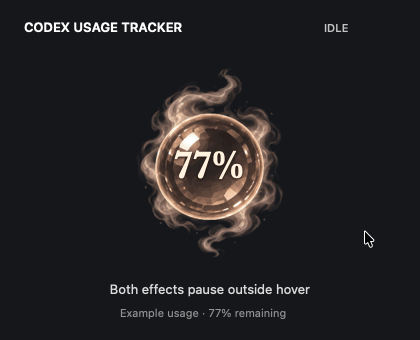

# Codex Usage Tracker · Mako Orb

A floating smoky-quartz companion for Mako that shows the **remaining weekly Codex limit** inside the orb. Its faceted glass, champagne rim, and smoky wisps follow the supplied fantasy-orb reference.



*Rendered from the app with example usage (77%): 2 seconds idle, a full 12-second hover cycle, then 2 seconds paused. [Still preview](docs/orb-hover.png).*

Double-click **Mako Orb.app** to launch it. Drag it beside Mako. Right-click the orb (or use its small menu-bar icon) to refresh, change its size or colour scheme, bring it back into view, or quit.

Hover over the orb to reveal two buttons: **New chat** (compose icon) and **Voice chat** (waveform icon). The smoke moves through a very slow 12-second cycle only while hovered, then pauses. A subtle shimmer inside the glass shares the same hover clock: both effects pause on exit and resume on re-entry. The percentage remains still. The animation respects macOS Reduce Motion.

**New chat** uses the documented `codex://threads/new` link. **Voice chat** opens a new Codex chat and sends its documented **Control–Shift–V** shortcut only to the Codex process. This requires Accessibility permission for Mako Orb: the first click offers to open **System Settings → Privacy & Security → Accessibility**. Enable Mako Orb there, then click Voice chat again. If it is absent, use **+** to add this app. No permission is granted automatically. Codex handles any microphone/voice setup. If you have changed the voice shortcut in Codex, restore Control–Shift–V for this button.

References: [Codex deep links and keyboard shortcuts](https://learn.chatgpt.com/docs/reference/commands), [voice setup](https://learn.chatgpt.com/docs/features/voice).

- Refreshes every 60 seconds while running and when the Mac wakes.
- Calculates `100 − usedPercent` from the Codex quota window whose duration is 10,080 minutes. Supports the weekly limit in either the primary or secondary position.
- Uses the installed Codex CLI and your existing Codex sign-in through the documented [`account/rateLimits/read` API](https://learn.chatgpt.com/docs/app-server#6-rate-limits-chatgpt).
- Usage polling does not run model requests, spend reset credits, or read/store authentication tokens itself. Chat and voice start only from your button clicks.
- Shows a dash when the connection fails, no weekly limit is available, the data is over three minutes old, or the reported reset time has passed.
- Choose **Colour scheme → Deep red, Mint green, Teal, Ivory, Purple**, or **Original** in the right-click menu. The selection is remembered after restarting.
- Remembers its position and size. Floats across desktops; stays independent of Mako's own movement and task notifications.
- Runs until you quit it. Open the app again after restarting your Mac; it has not been added to Login Items.

Mako's existing pet files and the Codex application are unchanged.

The app is built locally for this Mac and signed with an ad-hoc signature. Source is included in `main.swift`, `WeeklyUsage.swift`, and `OrbInteraction.swift`. To rebuild, run `zsh build.sh` in this folder. The build also checks weekly-window selection, remaining-percentage calculation, unavailable data, freshness, hover/pause timing, smoke motion, and shimmer containment. Rendering checks need normal macOS graphics access.

The artwork was created using the built-in image generation tool. The transparent PNG is in `Assets/smoky-quartz.png`, and the exact generation prompt is in `Assets/design-prompt.txt`. The percentage is rendered live by the app; it is not part of the image.

## Build from source

Requires macOS 13 or later, Xcode Command Line Tools (`xcode-select --install`), and a signed-in Codex desktop app.

```sh
git clone https://github.com/vighagen/codexUsageTracker.git
cd codexUsageTracker
zsh build.sh
open "Mako Orb.app"
```

The build creates a locally signed app for your Mac and runs the included usage, hover-clock, smoke, shimmer, and colour checks. Core Image's runtime shader API currently produces deprecation warnings but is verified working on the development Mac.

A prebuilt macOS app archive is provided under `dist/`. It is ad-hoc signed, not notarized; building locally is the recommended installation route.

## Regenerate the preview

Run `python3 scripts/render-preview.py` on macOS to render the GIF and PNG from the production view and shader code. The preview uses a fixed example percentage and does not connect to your Codex account.
